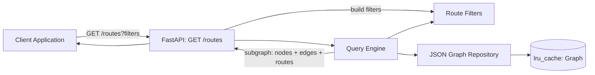

# Service Route Query Engine

A lightweight graph query engine built with **Python** and **FastAPI** that loads a microservice
dependency graph from a JSON file and exposes a REST API for querying service routes.

This is an interview exercise, based on the [Train Ticket](https://github.com/FudanSELab/train-ticket) microservices architecture.

Python/FastAPI was chosen to prioritize clarity, rapid development, and readability. Although the
assignment mentions TypeScript as preferred, FastAPI gives us automatic OpenAPI docs, strong typing
through Pydantic, and an excellent developer experience for a lightweight REST API — which keeps the
focus on the engine design rather than boilerplate.

---

## What it does

Given the microservice dependency graph, the API enumerates **routes** (paths from an entry service
to a terminal one) and lets you filter them. It returns a **render-ready subgraph** — only the nodes
and edges involved in the matching routes — so a frontend can draw the result directly without having
to filter 40+ services itself.

Supported filters (combined with **AND**):

- **Start in a public service** — the route starts at a node with `publicExposed: true`.
- **End in a sink** — the route ends at a datastore/queue (e.g. `kind = "rds"`).
- **Has a vulnerability** — at least one node on the route has a vulnerability finding.

The filtering system is generic: adding a new filter is a small, isolated change (see
[Adding a filter](#adding-a-filter)).

---

## Design decisions

- **The graph is immutable and loaded once.** It is parsed from JSON and cached with
  `functools.lru_cache`, then represented as an in-memory adjacency list for O(1) neighbor lookups.
- **Traversal, filtering, and the web layer are fully decoupled.** The DFS knows nothing about
  filters; filters know nothing about traversal; neither imports FastAPI. Each concern can evolve
  independently and is trivial to unit-test.
- **Filters are a self-registering Strategy.** Every filter implements a single `matches(route) -> bool`
  method behind a `RouteFilter` protocol, and a `from_query` classmethod that builds it from the request.
  Filters register themselves via `@register_filter` and are auto-discovered on import, so the web layer
  assembles the active filter list from the registry without a hand-maintained builder list. The engine
  just keeps routes that pass all active filters.
- **`Subgraph` is a first-class concept.** The engine exposes `find_routes(filters)` and
  `build_subgraph(routes)` as two explicit steps. The subgraph is the union of the nodes and edges
  the matching routes touch — this is exactly what makes the `{nodes, edges, routes}` response
  self-explanatory and directly renderable.
- **Generic engine, minimal surface.** The engine is built to be extended, but only the one endpoint
  the assignment asks for (`GET /routes`) is exposed — no speculative endpoints.

### Domain model

| Object | Responsibility |
|---|---|
| `Node` | One service / datastore / queue. `name` is its identity (the JSON has no `id`). |
| `Edge` | A directed `source → target` dependency. |
| `Graph` | The full graph loaded from JSON: node registry + edges + adjacency list. |
| `Route` | One concrete path of nodes, from a source to a sink. |
| `Subgraph` | The minimal slice (nodes + edges) needed to render a query result. |

### Assumptions

These were inferred from the data and the assignment; each is easy to change in one place:

- **A "route" is a source → sink path.** *Sources* are nodes with no incoming edges (entry points);
  *sinks* are nodes with no outgoing edges (terminals). All simple (cycle-free) paths between them are
  enumerated. Isolated nodes (no edges at all) are not routes.
- **Sinks are identified by `kind`.** The graph contains `rds` (PostgreSQL) and `sqs` sinks. The
  `end_kind` filter targets a specific kind (e.g. `rds`), matching the assignment's "Sink (rds/sql)".
- **The data has a dangling reference** (`assurance-service` is used by edges but never declared).
  The loader creates a stub node (`kind = "unknown"`) and logs a warning rather than crashing, so
  traversal stays consistent.
- **Edge `to` is polymorphic** in the source JSON (a string or a list of strings) and is normalized
  into individual edges at load time.

---

## Architecture

The service follows a simplified **Clean Architecture**: business logic is independent of the web
framework.

```
app/
├── api/            # FastAPI route(s): GET /routes
├── core/           # Configuration (graph path, sink kinds)
├── domain/         # Entities: Node, Edge, Graph, Route, Subgraph
├── repositories/   # JSON graph loader (parse, normalize, cache)
├── services/       # QueryEngine: traversal + filtering + subgraph reduction
├── filters/        # RouteFilter protocol + concrete filters
├── schemas/        # Request / response models (Pydantic)
├── data/           # Bundled Train Ticket graph JSON
└── main.py         # FastAPI app factory
```



Request flow: the API maps query params into a list of `RouteFilter`s, the engine enumerates
source → sink routes and keeps those passing every filter, then reduces them to a subgraph, which the
API serializes.

---

## API

### `GET /routes`

Query parameters (all optional; omitting one means "don't filter on it"):

| Param | Type | Effect |
|---|---|---|
| `start_public` | bool | Keep routes starting in a publicly exposed service. |
| `end_kind` | string | Keep routes ending in a node of this kind (e.g. `rds`). |
| `has_vulnerability` | bool | Keep routes where at least one node is vulnerable. |

Example:

```
GET /routes?start_public=true
GET /routes?end_kind=rds
GET /routes?has_vulnerability=true
```

Example response:

```json
{
  "nodes": [
    { "name": "auth-service", "kind": "service", "public": false, "vulnerable": true },
    { "name": "prod-postgresdb", "kind": "rds", "public": false, "vulnerable": false }
  ],
  "edges": [
    { "from": "auth-service", "to": "prod-postgresdb" }
  ],
  "routes": [
    ["auth-service", "prod-postgresdb"]
  ]
}
```

Interactive Swagger UI is available at `/docs`.

### Adding a filter

1. Drop a module in `app/filters/` with a class that:
   - is decorated with `@register_filter`,
   - has a `from_query(cls, query: RouteQuery) -> RouteFilter | None` classmethod (return `None` to skip the filter for a given request, or an instance to apply it), and
   - has a `matches(self, route: Route) -> bool` method.
2. If the filter is driven by a request parameter, add the corresponding field to `RouteQuery` in [`app/schemas/requests.py`](app/schemas/requests.py).

The filter is auto-discovered on import and assembled by `FilterFactory` in
[`app/filters/filter_factory.py`](app/filters/filter_factory.py), so no changes to [`app/api/routes.py`](app/api/routes.py),
traversal, or engine code are needed.

---

## Development

Requirements: Python 3.13+ and [uv](https://docs.astral.sh/uv/).

```bash
uv sync
uv run uvicorn app.main:app --reload
# open http://localhost:8000/docs
```

Run the tests:

```bash
uv run pytest
```

Lint:

```bash
uv run ruff check .
```

---

## Docker

```bash
docker build -t service-route-query-engine .
docker run -p 8000:8000 service-route-query-engine
# open http://localhost:8000/docs
```

---

## Future improvements

- Additional filters (severity threshold, path length, specific service on-path).
- Configurable traversal (BFS, max depth, shortest-path only) for very large graphs.
- Pagination / streaming for large result sets.
- Support alternative graph sources beyond the bundled JSON.
